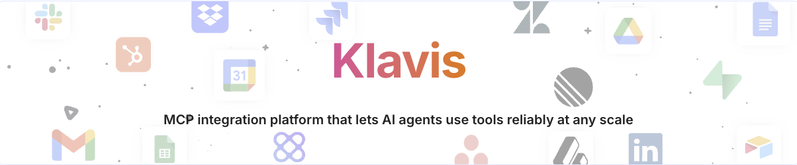

<div align="center">
  <picture>
    
  </picture>
</div>

<div align="center">

[](https://www.klavis.ai/docs)
[](https://www.klavis.ai)
[](https://discord.gg/p7TuTEcssn)

<a href="https://www.producthunt.com/products/strata-2?embed=true&utm_source=badge-top-post-badge&utm_medium=badge&utm_source=badge-strata&#0045;2" target="_blank"></a>

</div>

## 🎯 Choose Your Solution

<div align="center">
  <table>
    <tr>
      <td align="center" width="33%" valign="top" style="vertical-align: top; height: 250px;">
        <div style="height: 100%; display: flex; flex-direction: column; justify-content: space-between;">
          <div>
            <h2>Strata</h2>
            <p><strong>Intelligent connectors for your AI agent, optimize context window</strong></p>
          </div>
          <div>
            <a href="https://www.klavis.ai/docs/concepts/strata">
              
            </a>
          </div>
        </div>
      </td>
      <td align="center" width="33%" valign="top" style="vertical-align: top; height: 250px;">
        <div style="height: 100%; display: flex; flex-direction: column; justify-content: space-between;">
          <div>
            <h2>MCP Integrations</h2>
            <p><strong>100+ prebuilt integrations out-of-the-box, with OAuth support</strong></p>
          </div>
          <div>
            <a href="https://www.klavis.ai/docs/mcp-server/overview">
              
            </a>
          </div>
        </div>
      </td>
      <td align="center" width="33%" valign="top" style="vertical-align: top; height: 250px;">
        <div style="height: 100%; display: flex; flex-direction: column; justify-content: space-between;">
          <div>
            <h2>MCP Sandbox</h2>
            <p><strong>scalable MCP environments for LLM training and RL</strong></p>
          </div>
          <div>
            <a href="https://www.klavis.ai/docs/concepts/sandbox">
              
            </a>
          </div>
        </div>
      </td>
    </tr>
  </table>
</div>

## Quick Start

### Option 1: Cloud-hosted - [klavis.ai](https://www.klavis.ai)

[Quickstart guide →](https://www.klavis.ai/docs/quickstart)

### Option 2: Self-host

```bash
# Run any MCP Integration
docker pull ghcr.io/klavis-ai/github-mcp-server:latest
docker run -p 5000:5000 ghcr.io/klavis-ai/github-mcp-server:latest

# Install Open Source Strata locally
pipx install strata-mcp
strata add --type stdio playwright npx @playwright/mcp@latest
```

### Option 3: SDK

```python
# Python SDK
from klavis import Klavis
from klavis.types import McpServerName

klavis = Klavis(api_key="your-key")

# Create Strata instance
strata = klavis_client.mcp_server.create_strata_server(
    user_id="user123",
    servers=[McpServerName.GMAIL, McpServerName.SLACK],
)

# Or use individual MCP servers
gmail = klavis.mcp_server.create_server_instance(
    server_name=McpServerName.GMAIL,
    user_id="user123",
)
```

```typescript
// TypeScript SDK
import { KlavisClient, McpServerName } from 'klavis';

const klavis = new KlavisClient({ apiKey: 'your-api-key' });

// Create Strata instance
const strata = await klavis.mcpServer.createStrataServer({
    userId: "user123",
    servers: [Klavis.McpServerName.Gmail, Klavis.McpServerName.Slack],
});

// Or use individual MCP servers
const gmail = await klavis.mcpServer.createServerInstance({
    serverName: McpServerName.GMAIL,
    userId: "user123"
});
```

### Option 4: REST API


```bash
# Create Strata server
curl -X POST "https://api.klavis.ai/v1/mcp-server/strata" \
  -H "Authorization: Bearer your-api-key" \
  -H "Content-Type: application/json" \
  -d '{
    "user_id": "user123",
    "servers": ["GMAIL", "SLACK"]
  }'

# Create individual MCP server
curl -X POST "https://api.klavis.ai/v1/mcp-server/instance" \
  -H "Authorization: Bearer your-api-key" \
  -H "Content-Type: application/json" \
  -d '{
    "server_name": "GMAIL",
    "user_id": "user123"
  }'
```


## ❓ FAQ

### What is Klavis AI?

Klavis AI is an MCP (Model Context Protocol) integration platform that enables AI agents to reliably use tools at any scale. It provides intelligent connectors, prebuilt MCP server integrations, and scalable sandbox environments for LLM training.

### What are Strata connectors?

Strata is Klavis's intelligent connector system that optimizes context windows for AI agents. It dynamically manages tool connections, handles OAuth authentication, and provides intelligent routing to ensure agents can access the right tools at the right time.

### How many MCP integrations are available?

Klavis offers 100+ prebuilt MCP server integrations out-of-the-box, including GitHub, Gmail, Slack, Notion, Jira, and more. Each integration supports OAuth authentication and is maintained by the Klavis team.

### Can I self-host Klavis?

Yes! Klavis can be self-hosted using Docker. You can run individual MCP servers or deploy the full Klavis platform. See the [self-hosting guide](https://www.klavis.ai/docs) for detailed instructions.

### What is MCP Sandbox?

MCP Sandbox provides scalable, isolated environments for LLM training and reinforcement learning. It allows you to test and develop MCP integrations in a safe, reproducible environment without affecting production systems.

### How do I get started with the SDK?

Klavis provides both Python and TypeScript SDKs. Install via `pip install klavis` (Python) or `npm install klavis` (TypeScript), then use your API key to create Strata instances or individual MCP server connections.

### Does Klavis support custom MCP servers?

Yes. You can build custom MCP servers using the Klavis SDK or integrate existing MCP-compatible tools. The platform supports both stdio and SSE transport protocols.

### How does Klavis handle authentication?

Klavis uses OAuth 2.0 for most integrations. When a user connects a service like Gmail or Slack, Klavis handles the OAuth flow securely and stores encrypted credentials. For API-based integrations, Klavis supports API key management.

### Where can I get help?

- 📖 [Documentation](https://www.klavis.ai/docs)
- 💬 [Discord Community](https://discord.gg/p7TuTEcssn)
- 🐛 [GitHub Issues](https://github.com/klavis-ai/klavis/issues)

## Resources

- 📖 [Documentation](https://www.klavis.ai/docs)
- 💬 [Discord Community](https://discord.gg/p7TuTEcssn)
- 🐛 [Report Issues](https://github.com/klavis-ai/klavis/issues)
- 🌐 [Klavis AI Website](https://www.klavis.ai)

---

<div align="center">
  <p><strong>Made with ❤️ by the Klavis Team</strong></p>
</div>