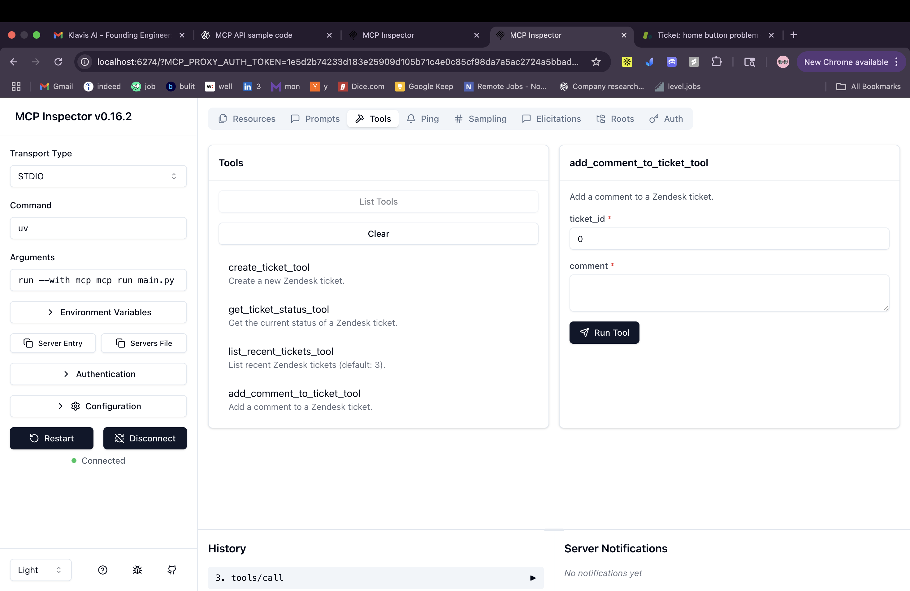
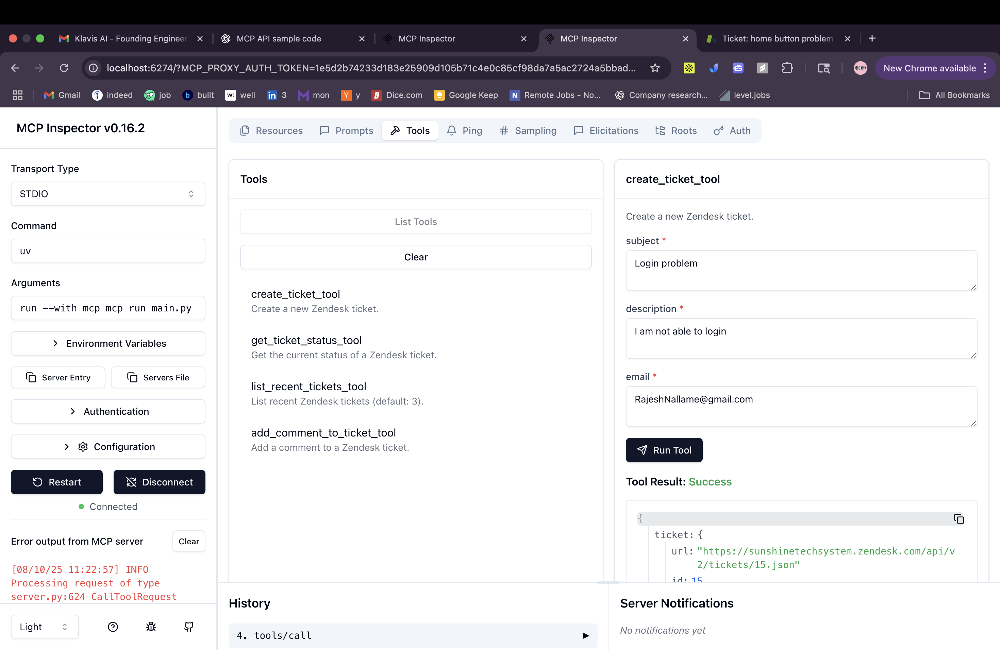
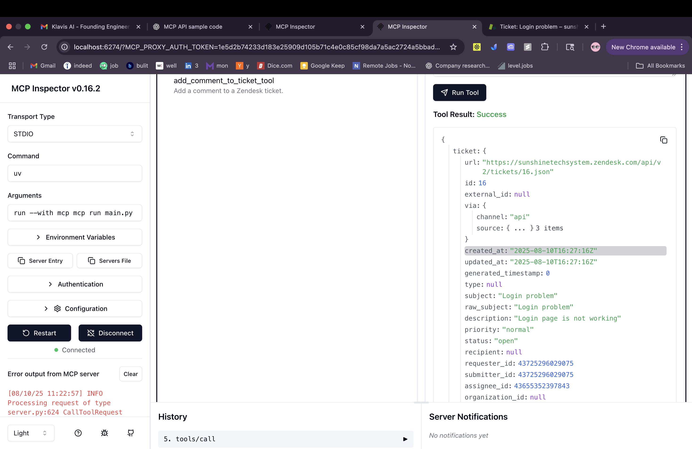
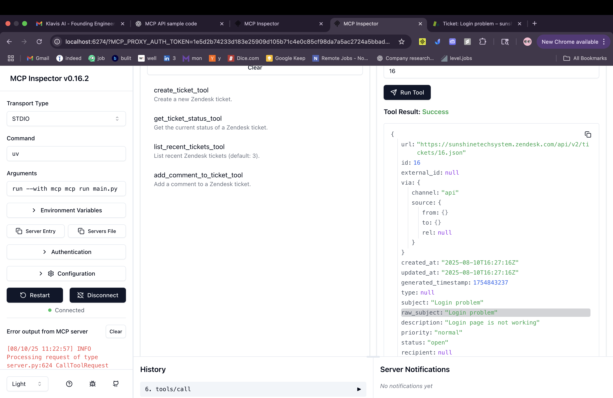
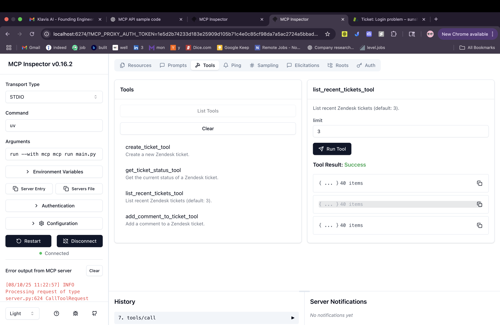
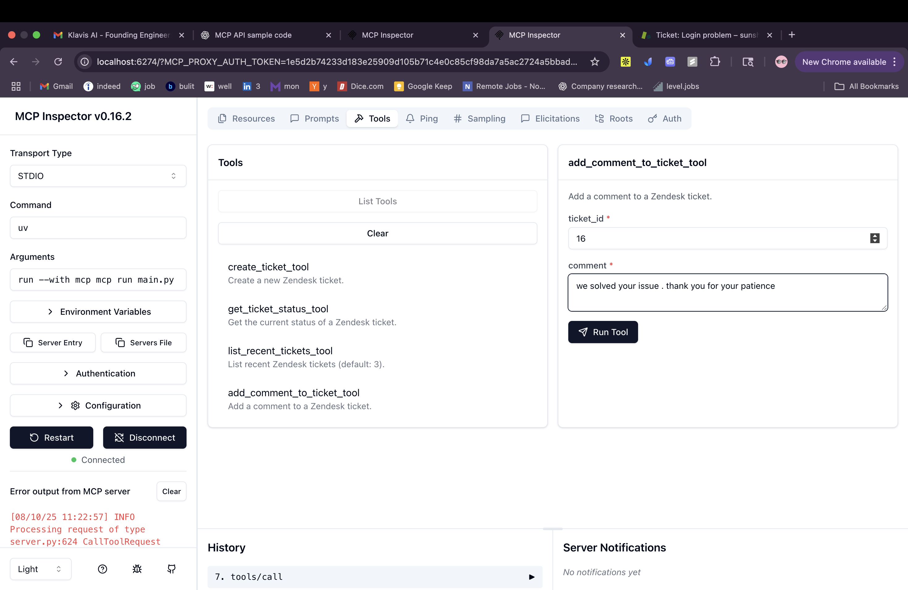
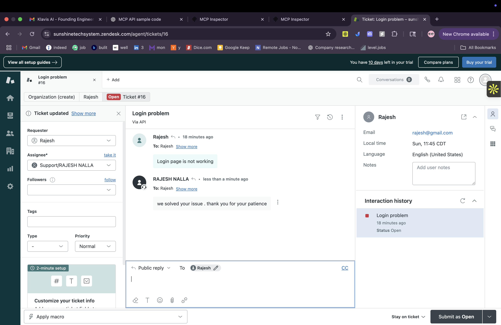

# Zendesk MCP Server

This project is a Model Context Protocol (MCP) compliant FastAPI server that integrates with the Zendesk Support API.  
It exposes atomic tools that allow AI agents or external systems to create, manage, and interact with Zendesk support tickets.

---

## 🚀 Features

Tool Name       
| `create_ticket`         | Creates a new support ticket in Zendesk                | 
| `get_ticket_status`     | Fetches the status, priority, and assignee of a ticket |     
| `list_recent_tickets`   | Lists recent Zendesk tickets with optional limit       |    
| `add_comment_to_ticket` | Adds a public or private comment to an existing ticket |  

---

## 🧱 Folder Structure

```
customer-service/
├── main.py
├── tools/
│   ├── create_ticket.py
│   ├── get_ticket_status.py
│   ├── list_recent_tickets.py
│   └── add_comment_to_ticket.py
├── .env
└── README.md

```
---

## 📦 Libraries Used
mcp
dotenv
FastMCP
httpx
mcp['cli']
---

## 🔐 .env Configuration

Create a `.env` file with:

```env
ZENDESK_EMAIL=email@company.com
ZENDESK_API_TOKEN=token_here
ZENDESK_SUBDOMAIN=companyname
```
---

##  Create and activate a virtual environment:

```bash
curl -LsSf https://astral.sh/uv/install.sh | sh
```

``` bash
# Create a new directory for our project
uv init filename
cd filename

# Create virtual environment and activate it
uv venv
source .venv/bin/activate

# Install dependencies
uv add "mcp[cli]" httpx

# Create our server file
touch main.py
```

2. Install requirements:

```bash
pip install -r requirements.txt
```

🚀 Running the MCP Server
```bash
    uv run mcp dev main.py
```


## ✅ Work Flow
```bash

Claude / MCP inspector stdio (MCP Client)
      |
      v
Cursor (MCP Host)
      |
      v
My MCP Server (Backend logic)
      |
      v
Zendesk (External API/service)
```

Execution: uv run mcp dev filename

##  Tools




## 🧰 Tools Description & Example Requests/Responses

### ✅ 1. `create_ticket`

Creates a new ticket using the user's email, subject, and description.

**Request Example:**


```json
{
  "subject": "Test ticket from MCP",
  "description": "This was created via MCP",
  "email": "testuser@example.com"
}
````

**Response Example:**




---

### ✅ 2. `get_ticket_status`

Fetches the current status, assignee, and priority of a given Zendesk ticket.

**Request Example:**


```json
{
  "ticket_id": 123456
}
```

**Response Example:**


```json
{
  "status": "open",
  "priority": "normal",
  "assignee_id": 789123
}
```

---

### ✅ 3. `list_recent_tickets`

Lists recent tickets with an optional `limit` parameter (default is 3).

**Request Example:**

```json
{
  "limit": 3
}
```

**Response Example:**



---

### ✅ 4. `add_comment_to_ticket`

Adds a comment to an existing ticket. Can be public or internal.

**Request Example:**

```json
{
  "ticket_id": 123456,
  "comment": "We are looking into this.",
  "public": true
}
```

**Response Example:**


