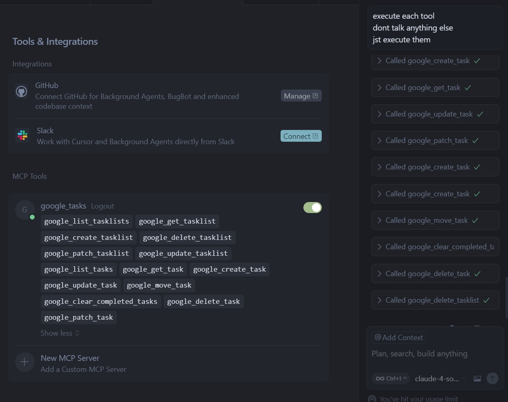

# Google Tasks MCP Server

[](https://opensource.org/licenses/MIT)
[](https://www.python.org/downloads/)
[](https://developers.google.com/tasks/reference/rest)

## 📖 Overview

This MCP (Model Context Protocol) server provides a robust set of tools for interacting with the Google Tasks API. It allows AI agents and other applications to manage tasklists and tasks programmatically, enabling seamless integration of Google Tasks into automated workflows.

The server exposes the core functionalities of Google Tasks as atomic, LLM-friendly tools, handling the complexities of Google's OAuth 2.0 authentication and API interactions behind a simple, standardized interface.

## 🚀 Features

This server provides comprehensive tools for managing both tasklists and tasks:

| Tool | Description |
|------|-------------|
| `google_list_tasklists` | List all tasklists for the authenticated user. |
| `google_get_tasklist` | Get a specific tasklist by its ID. |
| `google_create_tasklist` | Create a new tasklist. |
| `google_delete_tasklist` | Delete a tasklist by ID (including all its tasks). |
| `google_patch_tasklist` | Partially update a tasklist's metadata (e.g., title). |
| `google_update_tasklist` | Update a tasklist with full resource semantics. |
| `google_list_tasks` | List tasks within a specific tasklist. |
| `google_get_task` | Get a single task by its ID. |
| `google_create_task` | Create a new task in a specified tasklist. |
| `google_delete_task` | Delete a single task. |
| `google_patch_task` | Partially update a task's properties. |
| `google_update_task` | Update a task with full resource semantics. |
| `google_move_task` | Move a task to a different position or parent. |
| `google_clear_completed_tasks` | Permanently delete all completed tasks from a list. |

## 🔧 Prerequisites

- **Docker**: Installed and running (recommended for ease of use).
- **Python**: Python 3.12+ with `pip` and `venv` (for local development).

## ⚙️ Setup & Configuration

### Google Cloud OAuth Setup

To use this server, you need OAuth 2.0 credentials from the Google Cloud Console.

1.  **Create a Google Cloud Project**:
    - Go to the [Google Cloud Console](https://console.cloud.google.com/).
    - Create a new project or select an existing one.

2.  **Enable the Google Tasks API**:
    - In your project, navigate to "APIs & Services" > "Library".
    - Search for "Google Tasks API" and click "Enable".

3.  **Configure the OAuth Consent Screen**:
    - Go to "APIs & Services" > "OAuth consent screen".
    - Choose **External** and click "Create".
    - Fill in the required app information (app name, user support email, developer contact).
    - On the "Scopes" page, you don't need to add any scopes.
    - On the "Test users" page, add the Google account(s) you will use to test the application.

4.  **Create OAuth 2.0 Client ID**:
    - Go to "APIs & Services" > "Credentials".
    - Click "+ CREATE CREDENTIALS" and select "OAuth client ID".
    - For "Application type", select **Desktop app**.
    - Give it a name and click "Create".
    - A dialog will appear with your **Client ID** and **Client Secret**. Copy these values.

5.  **Generate a Refresh Token**:
    - The server uses a refresh token for long-term access. The easiest way to get one is using the [Google OAuth 2.0 Playground](https://developers.google.com/oauthplayground/).
    - In the Playground, click the gear icon in the top right, check "Use your own OAuth credentials", and paste your Client ID and Client Secret.
    - In the list of scopes on the left, find **Google Tasks API v1** and select `https://www.googleapis.com/auth/tasks`.
    - Click "Authorize APIs". You will be taken through the Google sign-in and consent flow.
    - After granting consent, you will be redirected back. Click "Exchange authorization code for tokens".
    - Your **Refresh token** will appear on the right. Copy this value.

### Environment Configuration

1.  **Create your environment file**:
    ```bash
    cp mcp_servers/google_tasks/.env.example mcp_servers/google_tasks/.env
    ```

2.  **Edit the `mcp_servers/google_tasks/.env` file** with your credentials:
    ```env
    GOOGLE_CLIENT_ID="YOUR_GOOGLE_CLIENT_ID"
    GOOGLE_CLIENT_SECRET="YOUR_GOOGLE_CLIENT_SECRET"
    GOOGLE_REFRESH_TOKEN="YOUR_GOOGLE_REFRESH_TOKEN"
    GOOGLE_TASKS_MCP_SERVER_PORT=5000
    ```

## 🏃‍♂️ Running the Server

### Option 1: Docker (Recommended)

The Docker build must be run from the project's root directory (`klavis/`).

```bash
# Build the Docker image from the project root
docker build -t google-tasks-mcp-server -f mcp_servers/google_tasks/Dockerfile .

# Run the container with your environment variables
docker run -d -p 5000:5000 \
  -e GOOGLE_CLIENT_ID=$GOOGLE_CLIENT_ID \
  -e GOOGLE_CLIENT_SECRET=$GOOGLE_CLIENT_SECRET \
  -e GOOGLE_REFRESH_TOKEN=$GOOGLE_REFRESH_TOKEN \
  --name google-tasks-mcp \
  google-tasks-mcp-server
```

### Option 2: Python Virtual Environment

```bash
# Navigate to the Google Tasks server directory
cd mcp_servers/google_tasks

# Create and activate a virtual environment
python3 -m venv .venv
source .venv/bin/activate  # On Windows: .venv\Scripts\activate

# Install dependencies
pip install -r requirements.txt

# Run the server (it will load variables from your .env file)
python server.py
```

The server will be accessible at `http://localhost:5000`.(assuming ur port is also at 5000)

## ✅ Proof of Correctness

The functionality of this MCP server has been verified through end-to-end testing of all available tools. The tests were performed in a sequence that mimics a typical user workflow to ensure atomicity and correctness.

**Testing Workflow:**

1.  **Tasklist Management**:
    - `google_create_tasklist`: A new tasklist was successfully created.
    - `google_list_tasklists`: The new tasklist appeared in the list.
    - `google_get_tasklist`: The specific tasklist was retrieved by its ID.
    - `google_patch_tasklist` & `google_update_tasklist`: The tasklist's title was successfully modified.
2.  **Task Management**:
    - `google_create_task`: Two new tasks were successfully created in the test tasklist.
    - `google_list_tasks`: Both tasks appeared in the list for the tasklist.
    - `google_get_task`: Each task was successfully retrieved by its ID.
    - `google_patch_task` & `google_update_task`: A task's title and status were successfully modified.
    - `google_move_task`: One task was successfully moved to be a sub-task of another.
3.  **Cleanup**:
    - `google_clear_completed_tasks`: All completed tasks were successfully cleared.
    - `google_delete_tasklist`: The test tasklist and its remaining contents were successfully deleted.
4. **transport**
    - both the sse and streamable http methods are tested

    

A video demonstrating this testing pipeline will be added below.

**[Link to Video ](https://youtu.be/JhYlHwPWW5U)**



