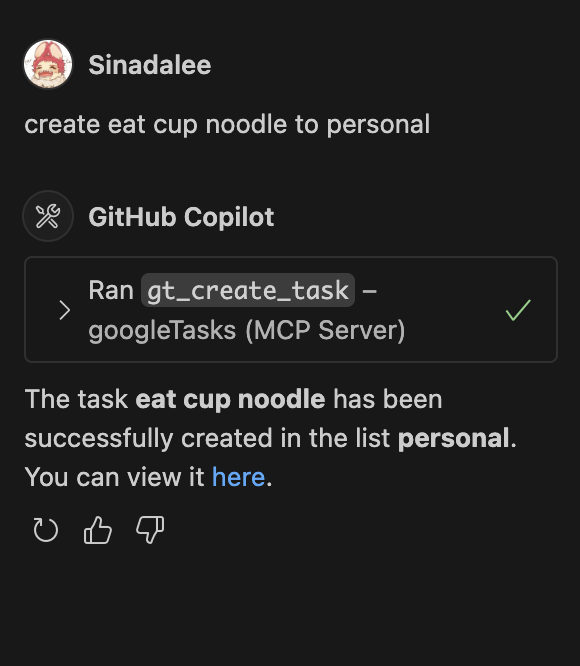

# Google Tasks MCP Server

An **MCP (Model Context Protocol)** server that exposes **atomic tools** for Google Tasks.
It speaks MCP over **Streamable HTTP** (`/mcp/`) and also supports **SSE** (`/sse`).
Use it from VS Code’s OpenAI/Copilot chat (with MCP enabled) or test directly with `curl`.

---

## Features

* **Atomic tools**: list task lists, create task list, list tasks, create task, update task, delete task.
* **Name-based arguments**: use **titles** instead of IDs (see below).
* **Rate limiting** (per tool, configurable).
* **Stateless** OAuth2 refresh-token auth to Google.
* **Dual transports**: SSE (`/sse`) and Streamable HTTP (`/mcp/`).

---

## Name-based arguments (easier than IDs)

Anywhere you’d normally supply an ID, you can provide a **title**:

* For lists, pass **`task_list_title`** instead of `task_list_id`.
* For tasks, pass **`task_title`** instead of `task_id` (together with a list id/title).

Resolution rules:

* Title match is **case-insensitive, exact**.
* If both id and title are provided, the **id wins**.
* If multiple tasks share the same title in a list, the call fails with an error listing candidates.
* If the list or task title isn’t found, you get a clear “not found” error.

---

## Project layout

```
.
├── server.py
├── requirements.txt
├── Dockerfile
├── .env.example
├── .vscode/
│   └── mcp.json        # example VS Code MCP client config
└── proof/              # screenshots (“proof of correctness”)
```

---

## Requirements

* Python 3.11+ (or Docker)
* A Google OAuth **Desktop** client with the **Tasks** scope
* A refresh token for `https://www.googleapis.com/auth/tasks`

Create an OAuth client in Google Cloud Console → OAuth consent → Credentials → “Create credentials → OAuth client ID → Desktop”, then obtain a refresh token (e.g., via OAuth Playground).

---

## Environment

Create `.env` from `.env.example`:

```env
GOOGLE_CLIENT_ID=your_client_id.apps.googleusercontent.com
GOOGLE_CLIENT_SECRET=your_client_secret
GOOGLE_REFRESH_TOKEN=your_refresh_token

# Optional
GOOGLE_TASKS_MCP_SERVER_PORT=5000
GOOGLE_TASKS_RATE_MAX=60
GOOGLE_TASKS_RATE_PERIOD=60
```

---

## Install & run

**Local Python**

```bash
python -m venv .venv
source .venv/bin/activate
pip install -r requirements.txt

python server.py \
  --port 5000 --log-level INFO \
  --rate-max 60 --rate-period 60
```

Expected log:

```
Server starting on port 5000 with dual transports:
  - SSE endpoint: http://localhost:5000/sse
  - StreamableHTTP endpoint: http://localhost:5000/mcp
Uvicorn running on http://0.0.0.0:5000
```

**Docker**

```bash
docker build -t google-tasks-server .
docker run --rm -it --env-file .env -p 5000:5000 google-tasks-server
```

> If port 5000 is taken, use another host port (e.g., `-p 5001:5000`) and update the client URL accordingly.

---

## Tools (input shapes)

| Tool                  | What it does              | Required                                                                                 | Optional                                                  |
| --------------------- | ------------------------- | ---------------------------------------------------------------------------------------- | --------------------------------------------------------- |
| `gt_list_task_lists`  | List all task lists       | —                                                                                        | —                                                         |
| `gt_create_task_list` | Create a new list         | `title`                                                                                  | —                                                         |
| `gt_list_tasks`       | List tasks in a list      | **one of** `task_list_id` or `task_list_title`                                           | —                                                         |
| `gt_create_task`      | Create a task             | **one of** `task_list_id` or `task_list_title`, `title`                                  | `notes`                                                   |
| `gt_update_task`      | Update title/notes/status | **one of** (`task_list_id` or `task_list_title`), **one of** (`task_id` or `task_title`) | `title`, `notes`, `status` = `needsAction` \| `completed` |
| `gt_delete_task`      | Delete a task             | **one of** (`task_list_id` or `task_list_title`), **one of** (`task_id` or `task_title`) | —                                                         |

---

## Testing with `curl`

> **Important**: Accept **both** `application/json` and `text/event-stream`.
> Use the **trailing slash** on `/mcp/`.

**List tools**

```bash
curl -N \
  -H "Content-Type: application/json" \
  -H "Accept: application/json, text/event-stream" \
  -d '{"jsonrpc":"2.0","id":"1","method":"tools/list"}' \
  http://localhost:5000/mcp/
```

**List task lists**

```bash
curl -N -H "Content-Type: application/json" \
  -H "Accept: application/json, text/event-stream" \
  -d '{"jsonrpc":"2.0","id":"2","method":"tools/call",
       "params":{"name":"gt_list_task_lists","arguments":{}}}' \
  http://localhost:5000/mcp/
```

**Create list “MCP Test”**

```bash
curl -N -H "Content-Type: application/json" \
  -H "Accept: application/json, text/event-stream" \
  -d '{"jsonrpc":"2.0","id":"3","method":"tools/call",
       "params":{"name":"gt_create_task_list",
                 "arguments":{"title":"MCP Test"}}}' \
  http://localhost:5000/mcp/
```

**Create task by *list title*** (“Write proof screenshots” in “MCP Test”) — *name-based*

```bash
curl -N -H "Content-Type: application/json" \
  -H "Accept: application/json, text/event-stream" \
  -d '{"jsonrpc":"2.0","id":"4","method":"tools/call",
       "params":{"name":"gt_create_task",
                 "arguments":{"task_list_title":"MCP Test",
                              "title":"Write proof screenshots",
                              "notes":"via MCP"}}}' \
  http://localhost:5000/mcp/
```

**List tasks by *list title*** — *name-based*

```bash
curl -N -H "Content-Type: application/json" \
  -H "Accept: application/json, text/event-stream" \
  -d '{"jsonrpc":"2.0","id":"5","method":"tools/call",
       "params":{"name":"gt_list_tasks",
                 "arguments":{"task_list_title":"MCP Test"}}}' \
  http://localhost:5000/mcp/
```

**Mark task completed by *titles*** — *name-based*

```bash
curl -N -H "Content-Type: application/json" \
  -H "Accept: application/json, text/event-stream" \
  -d '{"jsonrpc":"2.0","id":"6","method":"tools/call",
       "params":{"name":"gt_update_task",
                 "arguments":{"task_list_title":"MCP Test",
                              "task_title":"Write proof screenshots",
                              "status":"completed"}}}' \
  http://localhost:5000/mcp/
```

**Delete task by *titles*** — *name-based*

```bash
curl -N -H "Content-Type: application/json" \
  -H "Accept: application/json, text/event-stream" \
  -d '{"jsonrpc":"2.0","id":"7","method":"tools/call",
       "params":{"name":"gt_delete_task",
                 "arguments":{"task_list_title":"MCP Test",
                              "task_title":"Write proof screenshots"}}}' \
  http://localhost:5000/mcp/
```

---

## Using in VS Code (MCP)

1. Make sure the server is running (see logs for `/mcp` and `/sse`).
2. Create `.vscode/mcp.json`:

```json
{
  "servers": {
    "googleTasks": {
      "type": "http",
      "url": "http://localhost:5000/mcp/"
    }
  }
}
```

3. Open **OpenAI Chat** (swirl icon) or **Copilot Chat**:

   * Pick an Agent/Model (e.g., GPT-4o).
   * Click the **Tools** (beaker) icon and enable **googleTasks**.

4. Natural prompts you can use:

   * “List my Google Task lists.”
   * “Create a task list called ‘MCP Test’.”
   * “Create a task ‘Write proof screenshots’ in the list ‘MCP Test’.”
   * “Show tasks in ‘MCP Test’.”
   * “Mark ‘Write proof screenshots’ done in ‘MCP Test’.”
   * “Delete the task ‘Write proof screenshots’ in ‘MCP Test’.”

> Some clients ask to **Continue** before invoking a tool—that’s expected and can often be disabled in settings.

---

## Proof of correctness (screenshots)

**List & create**


**Create task (by id and by title)**




**List tasks**


**Update task (by id and by title)**


**Delete task (by id and by title)**


---

## Troubleshooting

* **Port already in use**
  Stop whatever is listening on `5000`, or run Docker on another host port: `-p 5001:5000` and set URL to `http://localhost:5001/mcp/`.

* **406 “Client must accept text/event-stream”**
  Add the correct header: `-H "Accept: application/json, text/event-stream"`.

* **307 redirect / 404**
  Use the **trailing slash**: `/mcp/`.

* **Invalid request parameters**
  Use MCP methods `tools/list` and `tools/call`. For `tools/call`, send:

  ```json
  {"name":"<tool-name>", "arguments": { ... }}
  ```

* **Google 401/403**
  Check `.env` values, the refresh token, and that the **Tasks** scope was authorized.

* **Rate limit exceeded**
  Increase `GOOGLE_TASKS_RATE_MAX` / `GOOGLE_TASKS_RATE_PERIOD`, or wait.

---

## Security

* The server is **stateless**; protect your `.env` (client id/secret + refresh token).
* Consider tightening rate limits before exposing beyond localhost.

---

## License

MIT