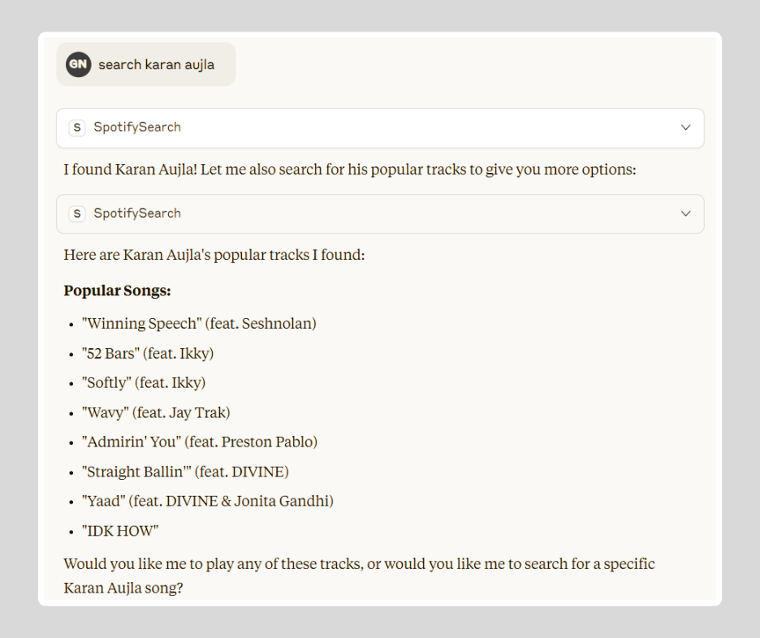
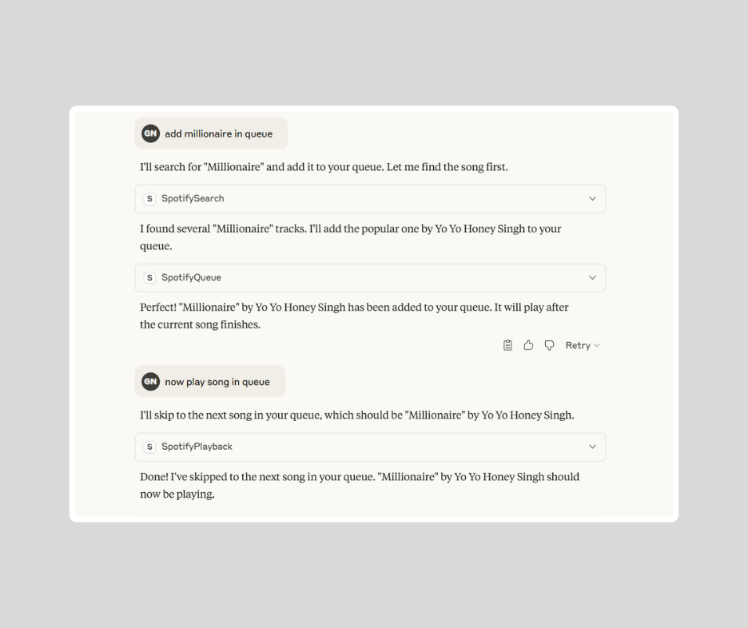
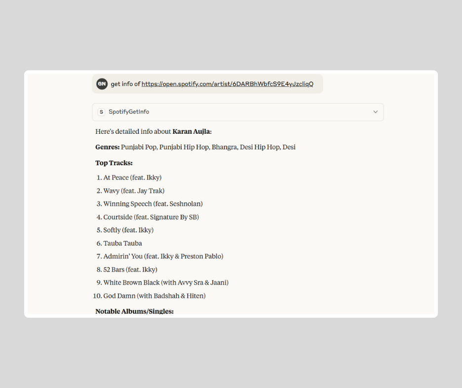
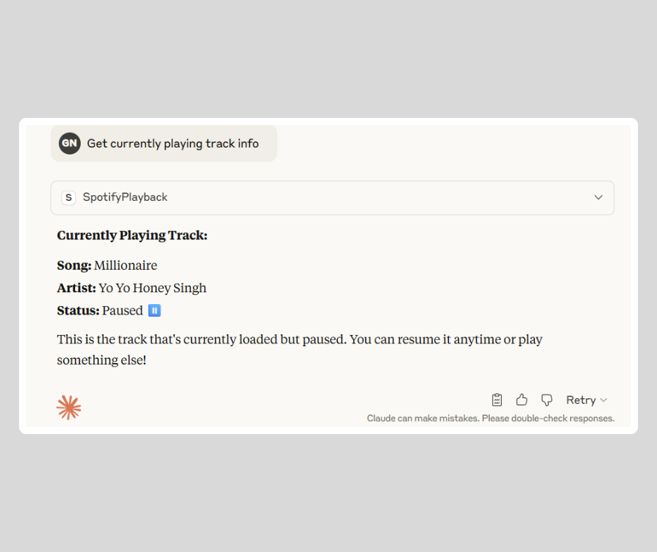

# Spotify MCP Server

A **Model Context Protocol (MCP)** server for Spotify, enabling access and play to music data such as artists, albums, tracks, and music playback through the Spotify Web API.

## Features

This server exposes the following Spotify functionalities as tools:

* **`spotify_search`** – Search for tracks, albums, artists, or playlists by query term.  
* **`spotify_get_info`** – Retrieve detailed information for a specific track, album, artist, or playlist using its Spotify URI.  
* **`spotify_get_current_track`** – Get the currently playing track.  
* **`spotify_start_playback`** – Start or resume Spotify playback for a specific track, album, or playlist.  
* **`spotify_pause_playback`** – Pause the current playback.  
* **`spotify_add_to_queue`** – Add a track to the playback queue.  
* **`spotify_get_queue`** – Get the current queue of tracks.  
* **`spotify_get_playlist_tracks`** – Retrieve tracks from a playlist.  

## Prerequisites

* **Python**: Version 3.10 or higher.  
* **pip**: Python package manager (comes with Python).  
* **Spotify Developer Account**: Create one at [Spotify for Developers](https://developer.spotify.com/dashboard).  
* **Spotify Client ID and Client Secret**: Obtain from your Spotify Developer Dashboard.

## Demo

<details>
  <summary>Video — turn on audio</summary>
  <video src="media/video1.mp4" controls></video>
</details>

<details>
  <summary>Video — turn on audio</summary>
  <video src="media/video2.mp4" controls></video>
</details>

### Screenshots
<p align="center">
  
  <br>
  
  
</p>


## Installation

1. Clone the repository and navigate to the Spotify MCP server directory:

```bash
cd spotify
```

2. Install dependencies:
```bash
uv pip install -e .
```

3. Create a `.env` file in the project root with your Spotify credentials:
```env
SPOTIFY_CLIENT_ID=YOUR_SPOTIFY_CLIENT_ID
SPOTIFY_CLIENT_SECRET="YOUR_SPOTIFY_CLIENT_SECRET"
```

### Run this project with uvx

Add this snippet to your MCP Config.

```json
"spotify": {
  "command": "uv",
  "args": [
    "--from",
    "git+https://github.com/varunneal/spotify-mcp",
    "spotify-mcp"
  ],
  "env": {
    "SPOTIFY_CLIENT_ID": YOUR_CLIENT_ID,
    "SPOTIFY_CLIENT_SECRET": YOUR_CLIENT_SECRET,
    "SPOTIFY_REDIRECT_URI": "http://127.0.0.1:8080/callback"
  }
}
```
